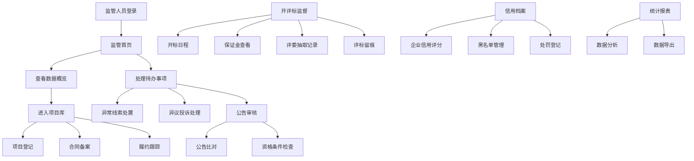

## 1. 产品概述
公共资源交易监管Web应用，为监管部门提供工程招投标、政府采购和产权交易全流程监管能力。通过数字化手段实现交易过程透明化、风险预警智能化、监管执法规范化，提升公共资源交易领域的监管效能和廉政风险防控水平。

## 2. 核心功能

### 2.1 用户角色
| 角色 | 注册方式 | 核心权限 |
|------|----------|----------|
| 监管人员 | 系统分配账号 | 全功能访问，项目监管、公告审核、异常线索处理、信用管理、统计分析 |
| 系统管理员 | 系统内置 | 用户管理、权限配置、系统参数设置、数据备份 |

### 2.2 功能模块
1. **监管首页**: 数据概览、待办事项、风险预警、交易动态
2. **项目库**: 工程招投标、政府采购、产权交易三类项目管理，项目登记、合同备案、履约跟踪
3. **公告审核**: 招标公告发布审核、公告内容比对、资格条件合规性提醒
4. **开评标监督**: 开标日程、保证金状态查看、评委抽取记录、评标过程留痕
5. **异常线索**: 围标串标线索标记、异议投诉受理、风险预警处置
6. **信用档案**: 企业信用评分、黑名单管理、处罚决定登记、信用信息查询
7. **统计报表**: 多维度数据统计分析、数据导出、监管台账生成

### 2.3 页面详情
| 页面名称 | 模块名称 | 功能描述 |
|----------|----------|----------|
| 监管首页 | 数据概览面板 | 交易项目总数、交易额、在监项目、异常线索数等关键指标卡片展示 |
| 监管首页 | 待办事项列表 | 待审核公告、待处理投诉、待处置预警等待办任务集中展示 |
| 监管首页 | 风险预警中心 | 高、中、低风险预警分类展示，支持快速跳转处置 |
| 监管首页 | 交易动态看板 | 最新交易项目动态、开标日程时间轴展示 |
| 项目库 | 项目分类管理 | 工程招投标、政府采购、产权交易三类项目分Tab管理 |
| 项目库 | 项目登记 | 新建项目信息录入，包括项目基本信息、预算金额、交易方式等 |
| 项目库 | 合同备案 | 交易完成后合同信息备案，合同文件上传 |
| 项目库 | 履约进度跟踪 | 项目履约阶段划分、进度填报、里程碑节点管理 |
| 公告审核 | 公告列表 | 待审核、已通过、已驳回公告列表，支持筛选搜索 |
| 公告审核 | 公告比对 | 公告内容自动比对，高亮显示差异项和不合规条款 |
| 公告审核 | 资格条件提醒 | 资格条件合规性智能检查，限制性条款自动识别提醒 |
| 开评标监督 | 开标日程 | 近期开标项目日历视图，开标时间、地点、项目信息展示 |
| 开评标监督 | 保证金状态 | 投标保证金缴纳情况统计，未缴纳、已缴纳、已退还状态跟踪 |
| 开评标监督 | 评委抽取记录 | 评委抽取过程记录，抽取时间、评委名单、回避情况记录 |
| 开评标监督 | 评标过程留痕 | 评标环节视频/文字记录存档，专家打分记录查询 |
| 异常线索 | 线索管理 | 围标串标线索列表，线索来源、风险等级、处置状态管理 |
| 异常线索 | 线索标记 | 人工标记疑似围标串标行为，关联相关企业和项目 |
| 异常线索 | 异议投诉受理 | 异议投诉登记、转办、处理、反馈全流程管理 |
| 异常线索 | 风险预警处置 | 系统自动预警信息确认、处置、归档 |
| 信用档案 | 企业信用档案 | 企业基本信息、交易记录、信用评分、奖惩信息一体化展示 |
| 信用档案 | 信用评分管理 | 信用评分指标配置、自动评分、人工调整 |
| 信用档案 | 黑名单管理 | 失信企业名单录入、移出、公示期管理 |
| 信用档案 | 处罚决定登记 | 行政处罚决定书录入、关联企业、信用扣分 |
| 统计报表 | 多维统计分析 | 按交易类型、行业、地区、时间等多维度统计分析 |
| 统计报表 | 可视化图表 | 柱状图、饼图、折线图等多种图表展示交易数据 |
| 统计报表 | 数据导出 | 支持Excel、PDF格式数据导出，监管台账自动生成 |

## 3. 核心流程
监管人员登录系统后，在首页查看整体交易概况和待办事项。根据业务需要进入相应功能模块：新项目登记→公告发布审核→开标评标监督→异常线索发现与处置→信用档案更新→统计报表生成。系统全程自动记录操作留痕，智能识别风险并预警。

## 4. 用户界面设计

### 4.1 设计风格
- **主色调**: 政务蓝 (#165DFF)，体现监管的权威性和专业性
- **辅助色**: 成功绿 (#00B42A)、警告橙 (#FF7D00)、危险红 (#F53F3F)，用于状态标识和风险等级
- **中性色**: 深灰 (#1D2129)、中灰 (#4E5969)、浅灰 (#C9CDD4)、极浅灰 (#F2F3F5)，用于文本和背景
- **按钮风格**: 直角按钮，2px边框，稳重严谨；主按钮填充主色，次要按钮描边
- **字体**: 采用思源黑体 (Source Han Sans)，体现政务系统的正式感和可读性；标题18-24px，正文14px，辅助文字12px
- **布局风格**: 顶部导航栏+左侧菜单+右侧内容区的经典政务系统布局；卡片式模块划分，信息层级清晰
- **图标风格**: 线性图标，简洁明了，统一2px描边

### 4.2 页面设计概览
| 页面名称 | 模块名称 | UI元素 |
|----------|----------|--------|
| 监管首页 | 数据概览面板 | 4-6个数据卡片，大号数字指标，渐变背景，hover微动效 |
| 监管首页 | 待办事项列表 | 列表式布局，带红色角标，点击跳转对应模块 |
| 监管首页 | 风险预警中心 | 三色风险卡片，闪烁动效提示高风险 |
| 项目库 | 项目列表 | 表格布局，支持多选、筛选、分页，操作列按钮 |
| 项目库 | 项目登记表单 | 分步表单，标签页划分信息分类，表单验证提示 |
| 公告审核 | 公告比对 | 左右分栏对比视图，差异项高亮标注 |
| 开评标监督 | 开标日程 | 日历视图+列表视图切换，今日开标突出显示 |
| 异常线索 | 线索详情 | 时间线展示线索处置全过程，附件上传区域 |
| 信用档案 | 企业画像 | 顶部企业信息栏，中部信用评分仪表盘，底部奖惩记录 |
| 统计报表 | 图表展示 | ECharts图表库，支持钻取、tooltip详情 |

### 4.3 响应式
- 桌面端优先设计，适配1920×1080及以上分辨率
- 平板端自适应，左侧菜单可折叠收起
- 关键数据页面支持移动端浏览，表格横向滚动

### 4.4 动效设计
- 页面切换：淡入淡出过渡，200ms时长
- 数据加载：骨架屏占位，内容渐显
- 按钮交互：点击缩放反馈，100ms过渡
- 风险预警：红色呼吸灯动效，吸引注意力
