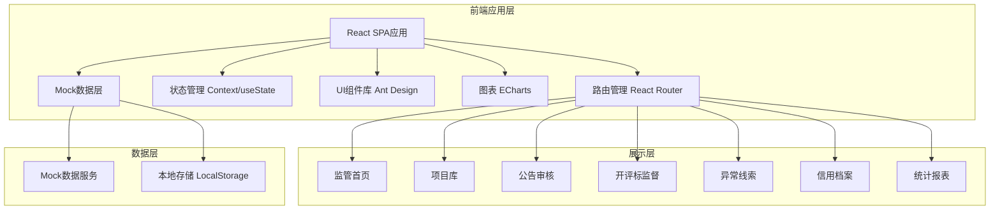

## 1. 架构设计



## 2. 技术描述
- **前端框架**: React@18 + TypeScript
- **构建工具**: Vite@5
- **样式方案**: Tailwind CSS@3 + CSS Modules
- **UI组件库**: Ant Design@5
- **路由管理**: React Router DOM@6
- **图表库**: ECharts@5 + echarts-for-react
- **图标库**: @ant-design/icons
- **日期处理**: dayjs
- **数据方案**: 前端Mock数据，使用TypeScript类型定义数据结构
- **代码规范**: ESLint + Prettier

## 3. 路由定义
| 路由路径 | 页面名称 | 说明 |
|----------|----------|------|
| / | 监管首页 | 系统首页，数据概览、待办事项、风险预警 |
| /projects | 项目库 | 项目列表、项目登记、合同备案、履约跟踪 |
| /projects/new | 新建项目 | 项目信息登记表单 |
| /announcements | 公告审核 | 公告列表、公告比对、资格条件检查 |
| /bidding | 开评标监督 | 开标日程、保证金状态、评委抽取、评标留痕 |
| /clues | 异常线索 | 线索管理、异议投诉、风险预警处置 |
| /credit | 信用档案 | 企业信用、黑名单、处罚登记 |
| /statistics | 统计报表 | 多维度统计、图表展示、数据导出 |

## 4. 数据模型定义

### 4.1 核心数据类型

```typescript
// 项目类型
type ProjectType = 'engineering' | 'procurement' | 'property';

// 项目状态
type ProjectStatus = 'registered' | 'announced' | 'bidding' | 'evaluating' | 'completed' | 'contract' | 'performing';

// 项目信息
interface Project {
  id: string;
  name: string;
  code: string;
  type: ProjectType;
  budget: number;
  purchaser: string;
  agency: string;
  status: ProjectStatus;
  registerDate: string;
  description: string;
  attachments: string[];
}

// 公告信息
interface Announcement {
  id: string;
  projectId: string;
  projectName: string;
  title: string;
  type: 'bidding' | 'clarification' | 'result';
  content: string;
  submitTime: string;
  status: 'pending' | 'approved' | 'rejected';
  reviewer: string;
  reviewTime?: string;
  reviewOpinion?: string;
}

// 开标信息
interface BiddingSession {
  id: string;
  projectId: string;
  projectName: string;
  startTime: string;
  location: string;
  status: 'scheduled' | 'ongoing' | 'completed';
  bondStatus: {
    total: number;
    paid: number;
    unpaid: number;
    refunded: number;
  };
}

// 评委抽取记录
interface JudgeExtraction {
  id: string;
  projectId: string;
  projectName: string;
  extractTime: string;
  judges: Array<{
    id: string;
    name: string;
    expertField: string;
    isRecused: boolean;
    recuseReason?: string;
  }>;
  operator: string;
}

// 异常线索
interface Clue {
  id: string;
  projectId?: string;
  projectName?: string;
  title: string;
  description: string;
  source: 'system' | 'manual' | 'complaint';
  riskLevel: 'high' | 'medium' | 'low';
  status: 'pending' | 'processing' | 'closed';
  relatedCompanies: string[];
  createTime: string;
  handler?: string;
  handleTime?: string;
  handleResult?: string;
}

// 异议投诉
interface Complaint {
  id: string;
  projectId: string;
  projectName: string;
  title: string;
  content: string;
  complainant: string;
  contact: string;
  submitTime: string;
  status: 'pending' | 'processing' | 'replied' | 'closed';
  handler?: string;
  replyContent?: string;
  replyTime?: string;
}

// 企业信用档案
interface CreditEnterprise {
  id: string;
  name: string;
  creditCode: string;
  legalPerson: string;
  contact: string;
  address: string;
  creditScore: number;
  creditLevel: 'AAA' | 'AA' | 'A' | 'B' | 'C' | 'D';
  isBlacklisted: boolean;
  blacklistReason?: string;
  blacklistTime?: string;
  punishments: Punishment[];
  projectCount: number;
  winCount: number;
}

// 处罚记录
interface Punishment {
  id: string;
  enterpriseId: string;
  title: string;
  content: string;
  punishmentType: string;
  decisionNo: string;
  decisionDate: string;
  scoreDeduction: number;
  documents: string[];
}

// 合同备案
interface Contract {
  id: string;
  projectId: string;
  projectName: string;
  contractNo: string;
  contractAmount: number;
  partyA: string;
  partyB: string;
  signDate: string;
  startDate: string;
  endDate: string;
  content: string;
  attachments: string[];
  performanceProgress: number;
  milestones: Milestone[];
}

// 履约里程碑
interface Milestone {
  id: string;
  contractId: string;
  name: string;
  planDate: string;
  actualDate?: string;
  status: 'pending' | 'in_progress' | 'completed' | 'delayed';
  description: string;
}

// 统计数据
interface StatisticsData {
  totalProjects: number;
  totalAmount: number;
  ongoingProjects: number;
  completedProjects: number;
  clueCount: number;
  complaintCount: number;
  blacklistCount: number;
  projectTypeStats: Array<{ type: string; count: number; amount: number }>;
  monthlyTrend: Array<{ month: string; count: number; amount: number }>;
  areaStats: Array<{ area: string; count: number }>;
}
```

## 5. 目录结构

```
src/
├── assets/              # 静态资源
│   └── images/
├── components/          # 公共组件
│   ├── Layout/          # 布局组件
│   ├── StatusTag/       # 状态标签
│   ├── DataCard/        # 数据卡片
│   ├── SearchForm/      # 搜索表单
│   └── TableWithPagination/
├── pages/               # 页面组件
│   ├── Dashboard/       # 监管首页
│   ├── Projects/        # 项目库
│   ├── Announcements/   # 公告审核
│   ├── Bidding/         # 开评标监督
│   ├── Clues/           # 异常线索
│   ├── Credit/          # 信用档案
│   └── Statistics/      # 统计报表
├── mock/                # Mock数据
│   ├── projects.ts
│   ├── announcements.ts
│   ├── bidding.ts
│   ├── clues.ts
│   ├── credit.ts
│   └── statistics.ts
├── types/               # TypeScript类型定义
│   └── index.ts
├── utils/               # 工具函数
│   ├── format.ts        # 格式化工具
│   └── constants.ts     # 常量定义
├── App.tsx
├── main.tsx
└── index.css
```

## 6. 页面组件结构

### 6.1 监管首页 (Dashboard)
- StatCards: 数据统计卡片组
- TodoList: 待办事项列表
- RiskWarning: 风险预警面板
- TransactionTrend: 交易趋势图表
- RecentActivities: 近期动态

### 6.2 项目库 (Projects)
- ProjectTabs: 项目分类标签页
- ProjectList: 项目列表表格
- ProjectForm: 项目登记表单(弹窗/新页面)
- ContractModal: 合同备案弹窗
- PerformanceModal: 履约跟踪详情

### 6.3 公告审核 (Announcements)
- AnnouncementList: 公告列表
- AnnouncementDetail: 公告详情
- CompareView: 公告比对视图
- ComplianceCheck: 资格条件检查结果

### 6.4 开评标监督 (Bidding)
- BiddingCalendar: 开标日历
- BondStatus: 保证金状态统计
- JudgeRecords: 评委抽取记录
- EvaluationTrail: 评标过程留痕

### 6.5 异常线索 (Clues)
- ClueList: 线索列表
- ClueDetail: 线索详情(含处置时间线)
- ComplaintList: 异议投诉列表
- ComplaintForm: 投诉受理表单
- WarningList: 风险预警列表

### 6.6 信用档案 (Credit)
- EnterpriseList: 企业列表
- EnterpriseProfile: 企业信用画像
- CreditScorePanel: 信用评分面板
- BlacklistManager: 黑名单管理
- PunishmentForm: 处罚登记表单

### 6.7 统计报表 (Statistics)
- OverviewCharts: 总览图表区
- TypeDistribution: 交易类型分布
- MonthlyTrendChart: 月度趋势图
- AreaAnalysis: 地区分析
- ExportPanel: 数据导出面板
